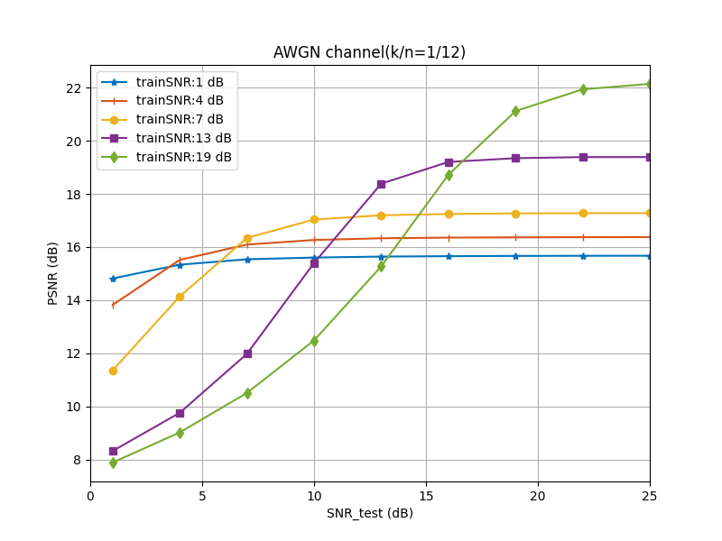
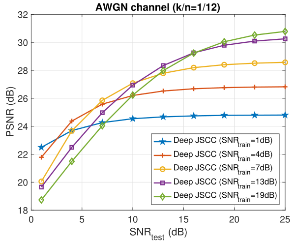
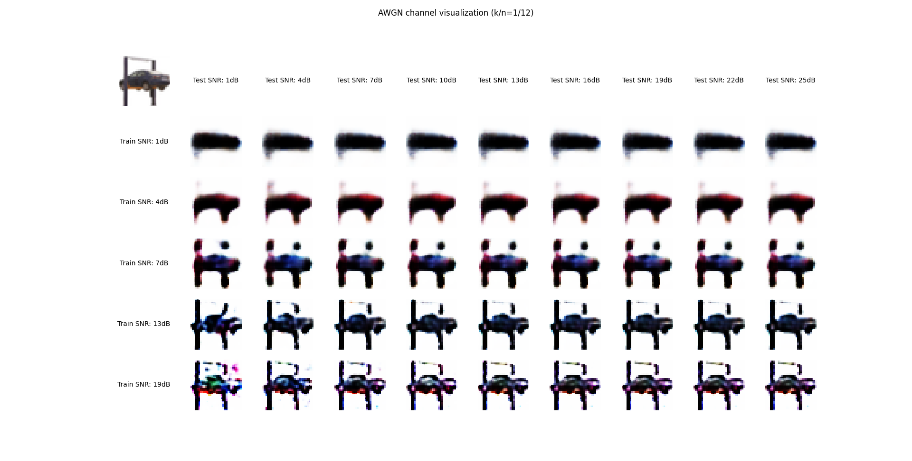

# DeepJSCC-for-Wireless-Image-Transmission
Implement of [E. Bourtsoulatze, D. Burth Kurka and D. Gündüz, "Deep Joint Source-Channel Coding for Wireless Image Transmission," in IEEE Transactions on Cognitive Communications and Networking, vol. 5, no. 3, pp. 567-579, Sept. 2019]
## Version
- TensorFlow version: 2.18.0
- Keras version: 3.6.0
## Complete List
- The provided code generates a performance plot of the Peak Signal-to-Noise Ratio (PSNR) for the deep Joint Source-Channel Coding (JSCC) algorithm on CIFAR-10 test images, considering different Signal-to-Noise Ratios (SNRs), in the case of bandwidth compression ratio versus an Additive White Gaussian Noise (AWGN) channel.
- The code also completes the image visualization under the above conditions.
## Existing Problems
- PSNR performance is not as good as in the paper.
- The convexity of train_SNR=13dB and train_SNR=19dB curves at the lower test_SNR is inconsistent with the paper.
  
PSNR performance by my code:

PSNR performance in the paper:

***I hope that my code can be of some help. Meanwhile, considering the existing problems, I sincerely hope that someone could kindly answer my questions!***

Image visualization by my code:

